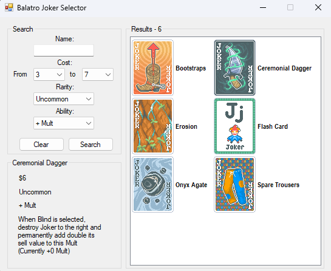

# Balatro Joker Searcher
This is a Windows Forms App used to filter, search for, and get info on the "Jokers" from the hit game Balatro. The program uses Dapper to run SQL queries on a local or external database to obtain the data it needs. This is a project made to demonstrate understating in C#, .NET, SQL, and Dapper. 
****

## Needed to run
- A machine with Microsoft SQL Server installed and able to run scripts
- Windows machine
## How to run

First, a database must be created and initialized. In the root of the repository, run the InitializationScript.sql file on the master of your database. This will create a database named BalatroJokerSearch, table named Jokers, procedures, and insert all joker values.

In the Executable folder of the repository, the BalatroJokerSearch.exe file can be run to start the program.

The first window will prompt the user the provide a connection string to the database. A default one is provided for users hosting the database on their own machine. This can be changed to connect to any database with any parameters.

